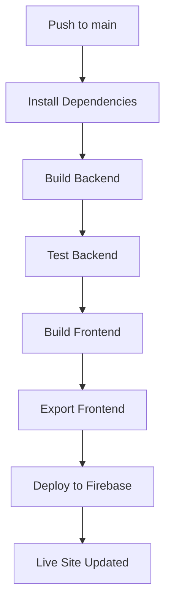

# CI/CD Setup Guide

## GitHub Actions Setup

The repository is configured with GitHub Actions for automated deployment to Firebase Hosting.

### Required Secrets

Go to your GitHub repository → Settings → Secrets and Variables → Actions, and add the following secrets:

#### 1. NEXT_PUBLIC_API_URL
- **Value**: Your deployed backend URL
- **Examples**:
  - Railway: `https://your-app-name.railway.app`
  - Render: `https://your-app-name.onrender.com`
  - Fly.io: `https://your-app-name.fly.dev`
- **Description**: This tells the frontend where to find the backend API

#### 2. FIREBASE_SERVICE_ACCOUNT_CONTRACTRECPLATFORM
- **Value**: Firebase service account JSON key
- **How to get**:
  1. Go to [Firebase Console](https://console.firebase.google.com/)
  2. Select your project (`contractrecplatform`)
  3. Go to Project Settings → Service Accounts
  4. Click "Generate new private key"
  5. Copy the entire JSON content and paste it as the secret value

### Workflow Details

The GitHub Actions workflow (`.github/workflows/deploy.yml`) will:

1. **On every push/PR**: 
   - Test and build both backend and frontend
   - Ensure code quality

2. **On push to `main` branch**:
   - Deploy frontend to Firebase Hosting
   - Use the configured API URL from secrets

### Manual Deployment Trigger

To manually trigger a deployment:

1. Go to your GitHub repository
2. Click "Actions" tab
3. Select "Deploy to Firebase Hosting" workflow
4. Click "Run workflow" → "Run workflow"

### Deployment Process



### Environment Variables in Production

Make sure your deployed backend has these environment variables set:

```bash
NODE_ENV=production
PORT=3001
CORS_ORIGIN=https://contractrecplatform.web.app

# Database configuration (from your hosting provider)
DATABASE_HOST=<your-db-host>
DATABASE_PORT=5432
DATABASE_USERNAME=<your-db-user>
DATABASE_PASSWORD=<your-db-password>
DATABASE_NAME=<your-db-name>

# Redis configuration
REDIS_HOST=<your-redis-host>
REDIS_PORT=6379

# Storage configuration
STORAGE_DRIVER=local
LOCAL_STORAGE_DIR=./data

# JWT secret (generate a strong secret)
JWT_SECRET=<generate-strong-secret>
```

### Troubleshooting

#### Build Fails
- Check that all environment variables are set correctly
- Verify the backend URL is accessible
- Check the Firebase service account key is valid

#### Deployment Fails
- Ensure Firebase project ID is correct
- Verify service account has deployment permissions
- Check that the frontend builds successfully locally

#### API Not Working After Deployment
- Verify `NEXT_PUBLIC_API_URL` points to the correct backend
- Check that backend CORS is configured for `https://contractrecplatform.web.app`
- Test backend health endpoint: `<backend-url>/api/v1/health/live`

### Local Testing

Before pushing to main, test locally:

```bash
# Test backend
cd backend
npm run build
npm run test

# Test frontend with production API
cd frontend
NEXT_PUBLIC_API_URL=<your-backend-url> npm run build
```

### Frontend Deployment Options

Since the application uses dynamic routes (`/invoices/[id]`), consider these alternatives to Firebase Hosting:

#### Option 1: Vercel (Recommended)
- Perfect for Next.js applications
- Supports SSR and dynamic routes out of the box
- Free tier available

#### Option 2: Netlify
- Good support for Next.js
- Easy setup with GitHub integration

#### Option 3: Firebase Hosting (Static Export)
- Requires refactoring dynamic routes to static paths
- Good for performance but requires more setup

#### Option 4: Railway/Render (Full-stack)
- Deploy both frontend and backend together
- Supports all Next.js features

### Current Configuration

The current setup is optimized for **Vercel deployment**:

1. Connect your GitHub repo to Vercel
2. Set environment variable: `NEXT_PUBLIC_API_URL=<your-backend-url>`
3. Vercel will auto-deploy on pushes to main

### Next Steps After Setup

1. **Deploy Backend**: Deploy to Railway, Render, or another platform
2. **Deploy Frontend**: Deploy to Vercel or chosen platform  
3. **Update API URL**: Set `NEXT_PUBLIC_API_URL` to your backend URL
4. **Test**: Verify full functionality end-to-end

### For Firebase Hosting (Alternative)

If you prefer Firebase Hosting, you'll need to:
1. Convert dynamic routes to static generation
2. Pre-generate all possible invoice ID paths
3. Update the build process for static export